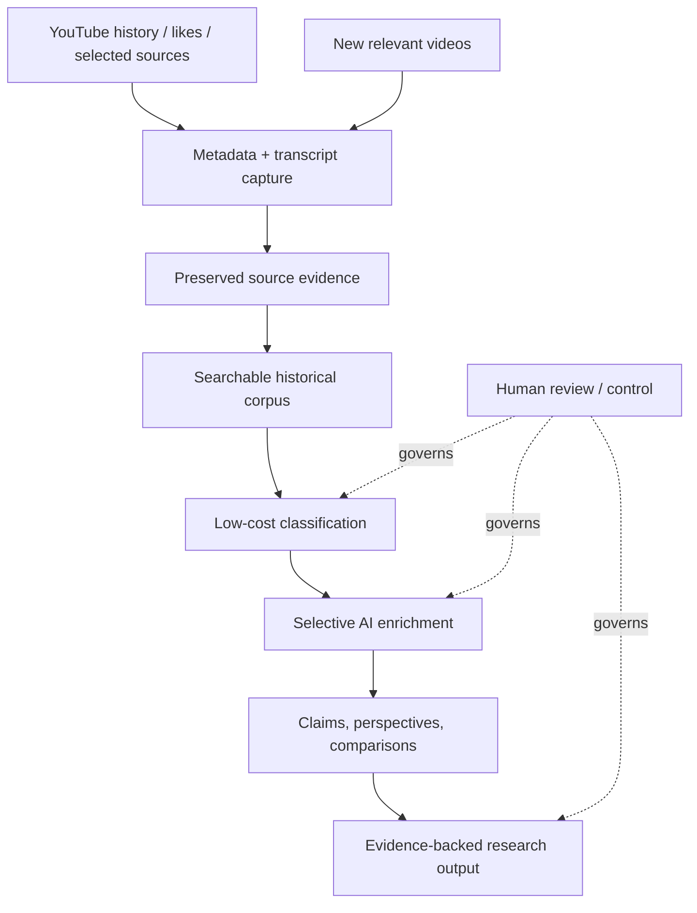

# YouTube Second Brain

**AI-assisted research and evidence system for turning large-scale video content into searchable, reusable intelligence.**

YouTube Second Brain is the YouTube research layer of a broader second-brain system. It is designed to capture useful video evidence, preserve the original source material, organize it for retrieval, and apply AI selectively for classification, comparison, verification, and deeper analysis.

The core principle is simple:

> **Capture once. Preserve the source evidence. Reanalyze and improve the derived intelligence over time.**

## Project at a glance

- **29,521 historical videos represented** in the verified search catalog
- Production lexical search published and independently verified through **Turso/libSQL**
- Automated intake path for new YouTube content
- Transcript and metadata evidence preserved before downstream analysis
- Deterministic processing used before AI escalation to control cost and reduce unnecessary model use
- Human-review boundaries preserved for ambiguity, taxonomy gaps, evidence quality, and live changes
- Automated repository security checks in the private implementation environment

## The problem

Useful information is often buried inside long videos, watch history, notes, bookmarks, and repeated discussions of the same topic. Traditional summarization solves only a small part of that problem.

A useful research system also needs to answer questions such as:

- What have I already seen about this topic?
- Which sources agree or disagree?
- What specific claims are being made?
- Which ideas are repeated, and which are genuinely new?
- Who introduced an idea first?
- What evidence supports or challenges the claims?
- What changed over time?
- Which material deserves deeper AI analysis, and which does not?

The project is designed around those questions rather than around one-off summaries.

## System design

The architecture separates **source evidence** from **derived analysis**. The evidence should remain stable even as models, prompts, classifications, and conclusions improve.

## What is already working

The historical search foundation has passed a production completion gate. The verified system represented **29,521 catalog videos**, passed validation and quality auditing, executed real search probes, published the complete lexical index to Turso/libSQL, independently verified the remote data, and produced a production evidence artifact.

The project also includes working or verified paths for:

- transcript and metadata capture
- preservation of canonical evidence
- resumable long-running processing
- deterministic classification before model escalation
- controlled handling of ambiguous or new-area content
- security and integrity checks
- durable project-state and handoff records so work can continue across AI sessions and tools

## What the next intelligence layer is designed to do

The next major layer moves beyond retrieval into **cross-source research intelligence**.

When several creators cover the same subject, the system is intended to compare them at the claim level rather than merely produce separate summaries. The design goal is to identify:

- specific claims made by each source
- agreements and disagreements
- chronology: who discussed an idea first and how later coverage evolved
- repeated framing versus unique contributions
- evidence quality and source discipline
- uncertainty, corrections, and changes over time
- important factual claims that should be checked against stronger external evidence
- missing perspectives or important angles not covered by the group

The system should avoid unsupported labels or accusations. Similarity does not automatically mean copying, and "bias" should not be reduced to a simplistic score. The goal is to preserve observable evidence about framing, claims, sources, timing, and differences so a human can make a better judgment.

## Future automation direction

The planned automation layer expands the Brain in three ways:

1. **Normal save:** liked or selected videos continue into the research archive.
2. **Send to Brain:** a dedicated manual path marks an individual video as especially important.
3. **Auto Scouts:** selected creators can be monitored under creator-specific rules so highly relevant new uploads can be captured and analyzed automatically.

For important developments, the target behavior is:

`new relevant video → capture evidence → classify → quick relevance alert → connect to related prior material → watch for same-topic coverage → produce deeper comparison when the topic develops`

## Design principles

**Evidence before interpretation.** Source material is preserved before downstream reasoning.

**Cheap before expensive.** Deterministic rules and bounded processing run before higher-cost AI analysis.

**Preserve broadly, think selectively.** Not every transcript needs deep model analysis.

**Do not force certainty.** Ambiguous material may remain unresolved instead of being pushed into the wrong category.

**Human control remains part of the system.** AI can organize, compare, retrieve, and surface evidence; important judgments remain reviewable.

**Project state should survive the chat.** Durable files, evidence, and explicit completion gates matter more than any single AI conversation.

## Part of a larger system

YouTube Second Brain is also being developed as one real product inside a broader experimental AI-assisted project operating system.

The long-term direction is to keep durable project state above any single model or conversation, then combine structured project design, staged execution, independent review, evidence gates, and explicit human decision points so work can move forward without depending on one LLM.

At a high level:

- **[Endless Chat OS](https://github.com/RyanMcConihe/endless-chat-os)** preserves project memory, handoffs, recovery state, and evidence across chats and AI providers.
- **Project Execution Engine** is the developing orchestration layer intended to turn project designs into Worlds, Levels, Checkpoints, reviews, and verified progression while recording non-blocking improvements for later review instead of repeatedly stopping active work.
- **YouTube Second Brain** is one product being built within that environment and provides a real-world test bed for the larger architecture.

Human decisions remain explicit gates for product design, meaningful cost choices, privacy/publication boundaries, and material tradeoffs. The broader architecture is still evolving, so future capabilities are intentionally described as direction rather than as finished functionality.

## My role

**Project Owner / AI Systems Designer**

I define the problem, research requirements, data structure, processing rules, quality gates, cost controls, failure behavior, and human-review standards. AI coding and reasoning tools are used as implementation partners, while requirements, acceptance criteria, testing decisions, evidence review, and project direction remain explicitly controlled.

The work combines product thinking, research design, AI-assisted workflow development, structured evaluation, and systems-level problem solving rather than treating AI as a black-box summarizer.

## Public / private boundary

This repository is intentionally a **public, high-level project view**.

The implementation repositories remain private. This public layer documents the project problem, design, verified milestones, architecture, operating principles, and development direction without exposing credentials, private source data, internal handoffs, or sensitive implementation details.

## Read more

- [YouTube Second Brain — project case study](projects/YOUTUBE_RESEARCH_BRAIN.md)
- [Building principles](BUILDING_PRINCIPLES.md)
- [Endless Chat OS — supporting project-memory system](projects/ENDLESS_THREAD.md)
